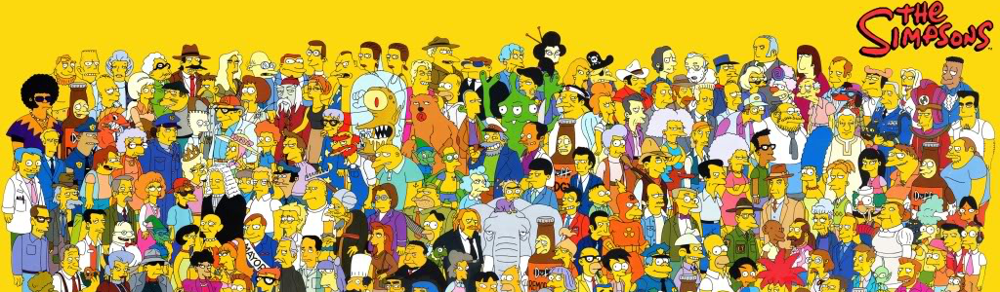

[![License][badge-mit]][license]
![Project-status][status-active]
<!--[![Colab][badge-colab]][colab]
[![Try-demo][badge-demo]][demo]-->

<h1>Classification-Simpsons</h1>

Creating a multi-class classification computer vision model based on CNN. Based on a dataset containing footage from «The Simpsons» cartoon, training the model to predict the residents of Springfield in different years. And also test the model on test data in the Kaggle competition.

 :hammer_and_wrench: Realised: image preparation, image augmentation, fine-tuning cv model.
 

<h2>Tech-skills:</h2>

<!---->

[status-active]: https://img.shields.io/badge/project%20status-active-brightgreen?style=for-the-badge&logo=appveyor.svg
[status-on-hold]: https://img.shields.io/badge/project%20status-on%20hold-yellow?style=for-the-badge&logo=appveyor.svg
[status-completed]: https://img.shields.io/badge/project%20status-completed-blueviolet?style=for-the-badge&logo=appveyor.svg
[status-cancelled]: https://img.shields.io/badge/project%20status-cancelled-red?style=for-the-badge&logo=appveyor.svg
[badge-mit]: https://img.shields.io/badge/License-MIT-blue?style=for-the-badge&logo=appveyor.svg
[license]: https://github.com/Fedorov-Nikita/Classification-Flags/blob/main/LICENSE.md
[badge-colab]: https://img.shields.io/badge/open%20in%20Colab-F9AB00?style=for-the-badge&logo=googlecolab&color=525252
[colab]: https://drive.google.com/
[badge-demo]: https://img.shields.io/badge/try%20demo-525252?style=for-the-badge&logo=Streamlit
[demo]: https://streamlit.io/
